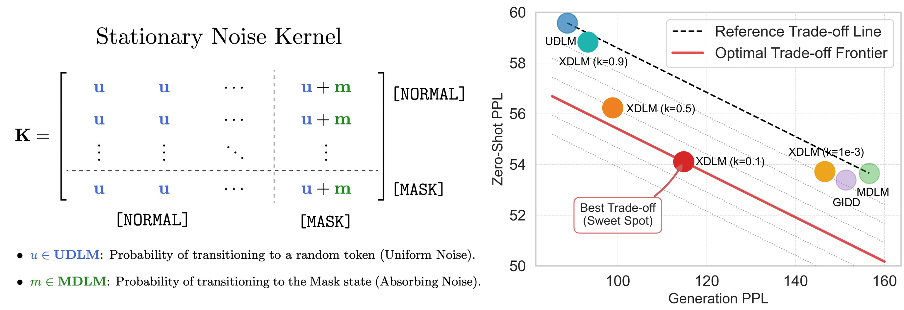
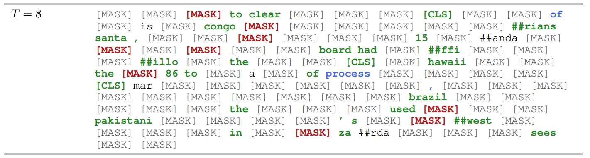

  
# [miXed Diffusion Language Modeling](https://arxiv.org/pdf/2602.01362)

This is the official implementaion of paper [***Balancing Understanding and Generation in Discrete Diffusion Models***](https://arxiv.org/pdf/2602.01362). This repository contains Pytorch training and evaluation code.

## Contents
- miXed Diffusion Language Modeling
  - [Introduction](#introduction)
  - [Highlights](#highlight)
  - [Preparation](docs/PREPARE.md)
  - [Training](docs/TRAIN.md)
  - [Evaluation](docs/EVALUATION.md)
  - [Contacts](#contacts)
  - [Acknowledgment](#acknowledgements)
  - [Citation](#citation)

## Introduction

In discrete generative modeling, two dominant paradigms demonstrate divergent capabilities: Masked Diffusion Language Models (MDLM) excel at semantic understanding and zero-shot generalization, whereas Uniform-noise Diffusion Language Models (UDLM) achieve strong few-step generation quality, yet neither attains balanced performance across both dimensions. To address this, we propose XDLM, which bridges the two paradigms via a stationary noise kernel. XDLM offers two key contributions: (1) it provides a principled theoretical unification of MDLM and UDLM, recovering each paradigm as a special case; and (2) an alleviated memory bottleneck enabled by an algebraic simplification of the posterior probabilities. Experiments demonstrate that XDLM advances the Pareto frontier between understanding capability and generation quality. Quantitatively, XDLM surpasses UDLM by 5.4 points on zero-shot text benchmarks and outperforms MDLM in few-step image generation (FID 54.1 vs. 80.8). When scaled to tune an 8B-parameter large language model, XDLM achieves 15.0 MBPP in just 32 steps, effectively doubling the baseline performance. Finally, analysis of training dynamics reveals XDLM’s superior potential for long-term scaling.

## Highlights

### LM1B Case

***Step-wise evolution of a generated sequence (T = 32).***
XDLM shows three different transition dynamics inherent to the hybrid noise process: `Green` represents new tokens generated from masks; `Blue` represents lexical refinement; and `Red` highlights the re-masking
operation where previously generated tokens are rejected and reverted to `[MASK]`.

### [LLaDA Continue Pretraining](https://github.com/MzeroMiko/LLaDA-XDLM)

***LLaDA-XDLM with sampling budget of 32.***
Evaluation of adapting LLaDA-8B to our XDLM for-
mulation (LLaDA-XDLM): (a) LLaDA-XDLM consistently out-performs baselines across diverse benchmarks with 32 sampling steps; (b) Improvements are particularly pronounced in code generation (MBPP), where the
model substantially reduces generation failures.

## Contacts
If you have any question about our work or this repository, please don't hesitate to contact us by emails or open an issue under this project.
- [liuyue171@mails.ucas.ac.cn](liuyue171@mails.ucas.ac.cn)
- [zhaoyuzhong20@mails.ucas.ac.cn](zhaoyuzhong20@mails.ucas.ac.cn)
- [caoshaosheng@xiaohongshu.com](caoshaosheng@xiaohongshu.com)
- [liuyunfan@ucas.ac.cn](liuyunfan@ucas.ac.cn)

## Acknowledgment

- Part of the code is borrowed from
[MDLM](https://github.com/kuleshov-group/mdlm),
[UDLM](https://github.com/kuleshov-group/discrete-diffusion-guidance),
[Duo](https://github.com/s-sahoo/duo),
[GIDD](https://github.com/dvruette/gidd),
[Taming-Transformers](https://github.com/CompVis/taming-transformers),
[LLamaGen](https://github.com/FoundationVision/LlamaGen),
we sincerely thank them for their contributions to the community.

## Citation

coming soon

